# Book Store Application - Test Cases

**Version:** 2.1  
**Date:** November 18, 2025  
**Total Test Cases:** 53

---

## 1. CATALOG PAGE TESTS (TC001-TC010)

### TC001: Book Listing Display

**Priority:** P0 - Critical  
**Pre-conditions:** User navigates to /catalog  
**Steps:**

1. Open application
2. Observe book grid

**Expected Result:**

- All books display in grid format
- Each card shows: title, author, price, image, "Buy Now" button
- Price formatted correctly with currency symbol
- Images load properly

**Actual Result:** ✅ PASS  
**Post-conditions:** User can browse catalog  
**Evidence:** 

---

### TC002: Search Books by Title

**Priority:** P1 - High  
**Pre-conditions:** On catalog page  
**Steps:**

1. Locate search bar at top of catalog
2. Type book title (e.g., "Gatsby")
3. Press Enter or click search icon

**Expected Result:**

- Search filters books in real-time
- Only matching books appear
- "No results" message if no matches

**Actual Result:** ✅ PASS  
**Post-conditions:** Filtered results displayed  
**Evidence:** 

---

### TC003: Search Books by Author

**Priority:** P1 - High  
**Pre-conditions:** On catalog page  
**Steps:**

1. In search bar, type author name (e.g., "Fitzgerald")
2. Press Enter

**Expected Result:**

- Books by that author appear
- Author name visible on cards

**Actual Result:** ✅ PASS  
**Post-conditions:** Author-filtered results shown  
**Evidence:** 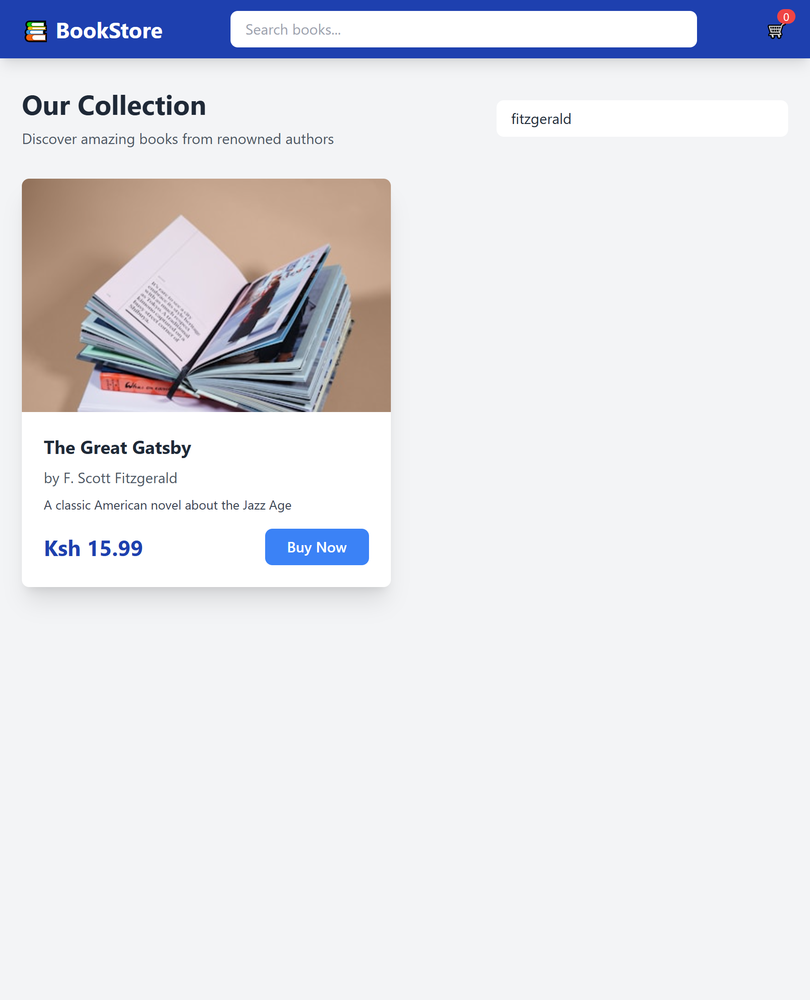

---

### TC004: Clear Search Results

**Priority:** P2 - Medium  
**Pre-conditions:** Search active with results  
**Steps:**

1. Clear search input field
2. Observe catalog

**Expected Result:**

- All books reappear
- Full catalog restored

**Actual Result:** ✅ PASS  
**Post-conditions:** Complete catalog visible  
**Evidence:** 

---

### TC005: Add Book to Cart from Catalog

**Priority:** P0 - Critical  
**Pre-conditions:** On catalog page  
**Steps:**

1. Find any book card
2. Click "Buy Now" button
3. Observe cart badge in navbar
4. Check for success feedback

**Expected Result:**

- Button changes to "Processing..." briefly
- Cart badge increments by 1
- Success message/toast appears: "Item added to cart"

**Actual Result:** PARTIAL PASS - Cart works but no user feedback  
**Post-conditions:** Book added to cart  
**Evidence:**   
**Defect ID:** DEFECT-015 (User Feedback)

---

### TC006: Catalog Responsive Layout - Mobile

**Priority:** P2 - Medium  
**Pre-conditions:** Browser resized to mobile width (<768px)  
**Steps:**

1. Resize browser to 390px width
2. Observe book grid layout

**Expected Result:**

- Books stack in single column
- Cards resize properly
- All content readable

**Actual Result:** ✅ PASS  
**Post-conditions:** Mobile view functional  
**Evidence:** .png>)

---

### TC007: Catalog Responsive Layout - Tablet

**Priority:** P2 - Medium  
**Pre-conditions:** Browser at tablet width (768-1024px)  
**Steps:**

1. Resize browser to 768px
2. Check book grid

**Expected Result:**

- 2 columns of books
- Proper spacing maintained

**Actual Result:** ✅ PASS  
**Post-conditions:** Tablet layout works  
**Evidence:** .png>)

---

### TC008: Book Image Loading

**Priority:** P2 - Medium  
**Pre-conditions:** Fresh page load  
**Steps:**

1. Clear browser cache
2. Reload /catalog
3. Observe image loading

**Expected Result:**

- Images appear progressively
- No broken image icons

**Actual Result:** ✅ PASS  
**Post-conditions:** Images loaded

---

### TC009: Currency Display Consistency

**Priority:** P0 - Critical  
**Pre-conditions:** REACT_APP_CURRENCY set in .env  
**Steps:**

1. Check .env for currency (e.g., NGN)
2. Restart server
3. View catalog prices

**Expected Result:**

- All prices show correct currency symbol
- Format: ₦15.99 (NGN) or $15.99 (USD)

**Actual Result:** ✅ PASS (after server restart)  
**Post-conditions:** Currency displayed correctly  
**Notes:** Requires server restart after .env change

---

### TC010: Empty Catalog Handling

**Priority:** P2 - Medium  
**Pre-conditions:** No books in mock data  
**Steps:**

1. Mock empty books array
2. Load catalog

**Expected Result:**

- "No books available" message
- No error thrown

**Actual Result:** ⚠️ NOT TESTED (requires code change)  
**Post-conditions:** Graceful empty state  
**Evidence:** N/A

---

## 2. CART PAGE TESTS (TC011-TC022)

### TC011: Navigate to Cart Page

**Priority:** P0 - Critical  
**Pre-conditions:** At least 1 item in cart  
**Steps:**

1. Click cart icon in navbar
2. Verify URL changes to /cart

**Expected Result:**

- Page navigates to /cart
- Cart contents displayed

**Actual Result:** ✅ PASS  
**Post-conditions:** On cart page  
**Evidence:** 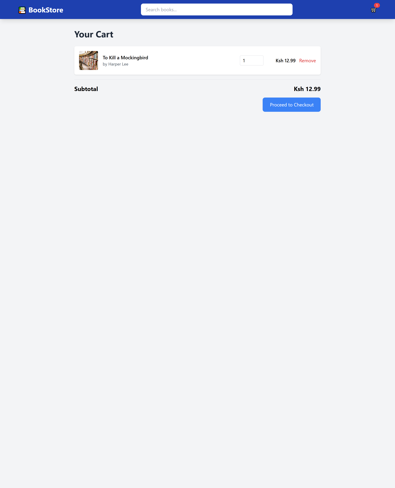

---

### TC012: View Cart Items

**Priority:** P0 - Critical  
**Pre-conditions:** Items in cart  
**Steps:**

1. Navigate to /cart
2. Observe cart items list

**Expected Result:**

- Each item shows: image, title, author, price, quantity
- Subtotal calculated per item
- Cart total at bottom

**Actual Result:** ✅ PASS  
**Post-conditions:** Cart details visible  
**Evidence:** 

---

### TC013: Update Item Quantity (Increase)

**Priority:** P0 - Critical  
**Pre-conditions:** Item with qty=1 in cart  
**Steps:**

1. Locate quantity controls
2. Click "+" button
3. Observe quantity and subtotal

**Expected Result:**

- Quantity increments to 2
- Subtotal doubles
- Cart total updates

**Actual Result:** ✅ PASS  
**Post-conditions:** Quantity increased  
**Evidence:** 

---

### TC014: Update Item Quantity (Decrease)

**Priority:** P0 - Critical  
**Pre-conditions:** Item with qty≥2  
**Steps:**

1. Click "-" button
2. Check quantity

**Expected Result:**

- Quantity decrements by 1
- Subtotal recalculated
- Total updates

**Actual Result:** ✅ PASS  
**Post-conditions:** Quantity decreased  
**Evidence:** 

---

### TC015: Remove Item from Cart

**Priority:** P0 - Critical  
**Pre-conditions:** Multiple items in cart  
**Steps:**

1. Click "Remove" button on one item
2. Observe cart
3. Check for confirmation dialog
4. Check for success feedback

**Expected Result:**

- Confirmation dialog: "Remove this item?"
- After confirming: Item removed instantly
- Success message: "Item removed from cart"
- Cart total recalculated
- Cart badge in navbar decrements

**Actual Result:** PARTIAL PASS - Removal works but no confirmation or feedback  
**Post-conditions:** Item removed  
**Evidence:** 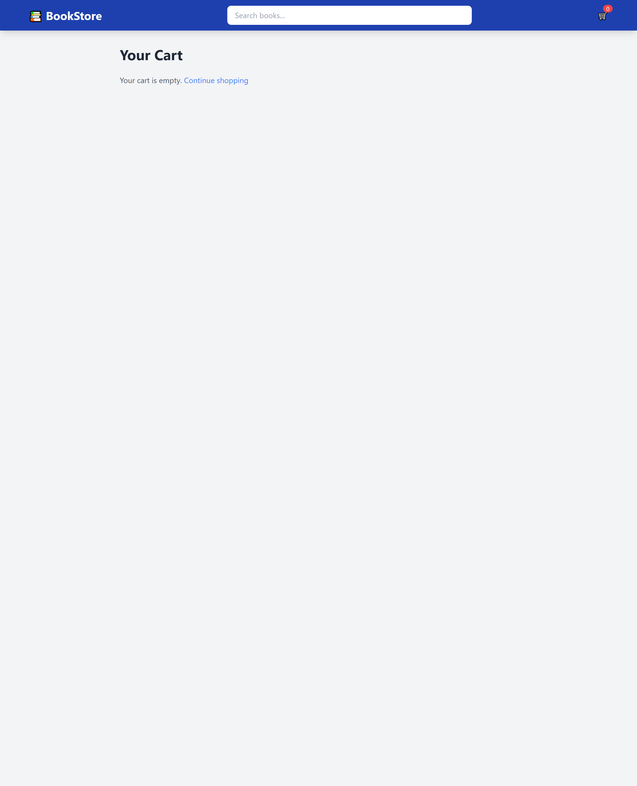  
**Defect ID:** DEFECT-013 (No confirmation), DEFECT-015 (No feedback)

---

### TC016: Remove Last Item in Cart

**Priority:** P1 - High  
**Pre-conditions:** Only 1 item in cart  
**Steps:**

1. Remove the last item

**Expected Result:**

- "Your cart is empty" message appears
- Checkout button disabled or hidden
- Cart badge shows 0

**Actual Result:** ✅ PASS  
**Post-conditions:** Empty cart state  
**Evidence:** 

---

### TC017: Cart Badge Count Accuracy

**Priority:** P0 - Critical  
**Pre-conditions:** Empty cart  
**Steps:**

1. Add 3 books from catalog
2. Check navbar cart badge
3. Add 2 more books
4. Verify badge again

**Expected Result:**

- Badge shows 3 after first additions
- Badge shows 5 after adding 2 more
- Count accurate at all times

**Actual Result:** ✅ PASS (Verified with 12 items)  
**Post-conditions:** Badge always accurate  
**Evidence:** 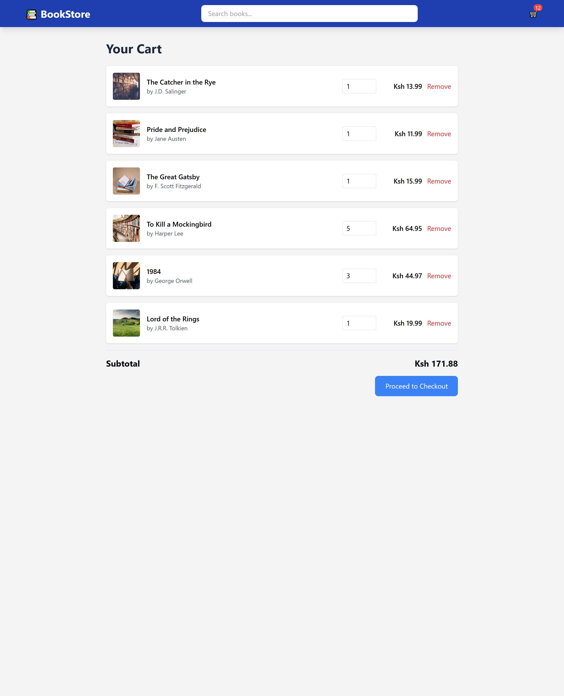

---

### TC018: Cart Persistence After Refresh

**Priority:** P1 - High  
**Pre-conditions:** Items in cart  
**Steps:**

1. Add books to cart
2. Refresh browser (F5)
3. Check cart

**Expected Result:**

- All items still in cart
- Quantities preserved
- Total correct

**Actual Result:** ✅ PASS  
**Post-conditions:** Cart persists  
**Evidence:**   
**Notes:** Uses localStorage

---

### TC019: Cart Persistence Across Pages

**Priority:** P1 - High  
**Pre-conditions:** Items in cart  
**Steps:**

1. Add items to cart
2. Navigate to catalog
3. Navigate back to cart

**Expected Result:**

- Cart contents unchanged
- Badge count consistent

**Actual Result:** ✅ PASS  
**Post-conditions:** Cart state maintained  
**Evidence:** 

---

### TC020: Empty Cart Direct Navigation

**Priority:** P2 - Medium  
**Pre-conditions:** Empty cart  
**Steps:**

1. Clear all cart items
2. Type /cart in URL bar
3. Press Enter

**Expected Result:**

- Cart page loads
- "Empty cart" message shown
- Checkout button disabled

**Actual Result:** ✅ PASS  
**Post-conditions:** Empty cart page displayed  
**Evidence:** 

---

### TC021: Cart Total Calculation

**Priority:** P0 - Critical  
**Pre-conditions:** Multiple items with different quantities  
**Steps:**

1. Add: Book A ($10, qty=2), Book B ($15, qty=1)
2. Verify total

**Expected Result:**

- Book A subtotal: $20.00
- Book B subtotal: $15.00
- Cart total: $35.00

**Actual Result:** ✅ PASS  
**Post-conditions:** Math correct  
**Evidence:** 

---

### TC022: Quantity Input Field Usability Issue

**Priority:** P2 - Medium  
**Pre-conditions:** Item added to cart  
**Steps:**

1. Navigate to cart page
2. Click on the quantity input field (showing default value "1")
3. Attempt to clear the field to enter a new quantity (e.g., "4")
4. Observe field behavior

**Expected Result:**

- User should be able to clear the quantity field and type a new value directly
- OR functional +/- buttons should be visible and working to adjust quantity
- User can easily change quantity from 1 to any desired value (e.g., 4)

**Actual Result:** ❌ FAIL - Cannot clear the default "1" from the input field

- No visible or functional +/- increment/decrement buttons
- User unable to modify quantity value
- Quantity remains stuck at default value

**Post-conditions:** Cart quantity cannot be updated, blocking user from purchasing multiple items  
**Evidence:** 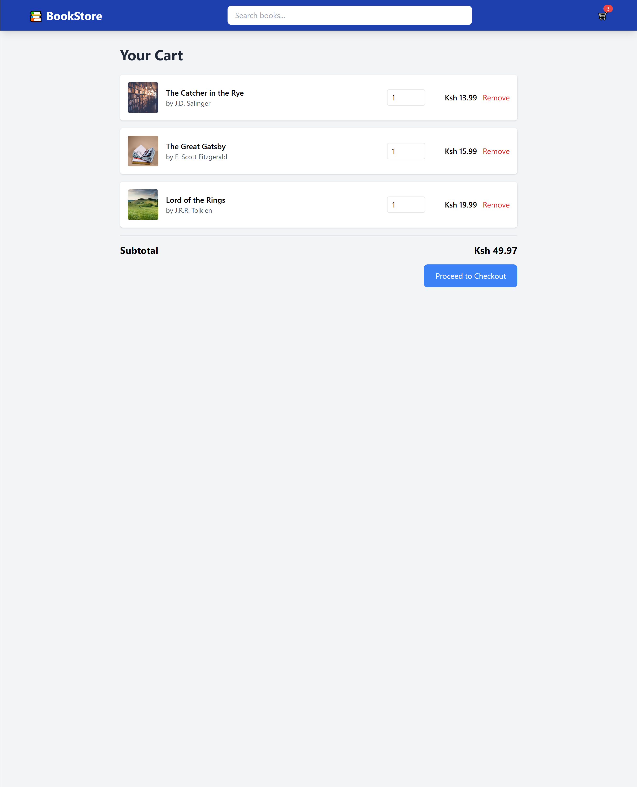  
**Defect ID:** DEFECT-016

---

## 3. CHECKOUT TESTS (TC023-TC034)

### TC023: Navigate to Checkout from Cart

**Priority:** P0 - Critical  
**Pre-conditions:** Items in cart  
**Steps:**

1. On /cart, click "Proceed to Checkout"
2. Verify URL

**Expected Result:**

- Redirects to /checkout
- Shipping form displayed

**Actual Result:** ✅ PASS  
**Post-conditions:** On checkout page  
**Evidence:** 

---

### TC024: Checkout Page Access with Empty Cart

**Priority:** P1 - High  
**Pre-conditions:** Empty cart  
**Steps:**

1. Type /checkout in browser
2. Press Enter

**Expected Result:**

- Redirect to /cart or /catalog
- Error message: "Add items to cart first"

**Actual Result:** ✅ PASS

- Message displayed: "Your cart is empty"
- Hyperlink provided: "Continue shopping"
- Link redirects to /catalog page
- User successfully prevented from checking out with empty cart

**Post-conditions:** User redirected to catalog via "Continue shopping" link  
**Evidence:** 

---

### TC025: Shipping Form Validation - All Fields Empty

**Priority:** P0 - Critical  
**Pre-conditions:** On checkout page  
**Steps:**

1. Leave all fields blank
2. Click "Continue to Payment"

**Expected Result:**

- HTML5 validation triggers
- Fields show "This field is required"
- Cannot proceed

**Actual Result:** ✅ PASS  
**Post-conditions:** Form not submitted  
**Evidence:** 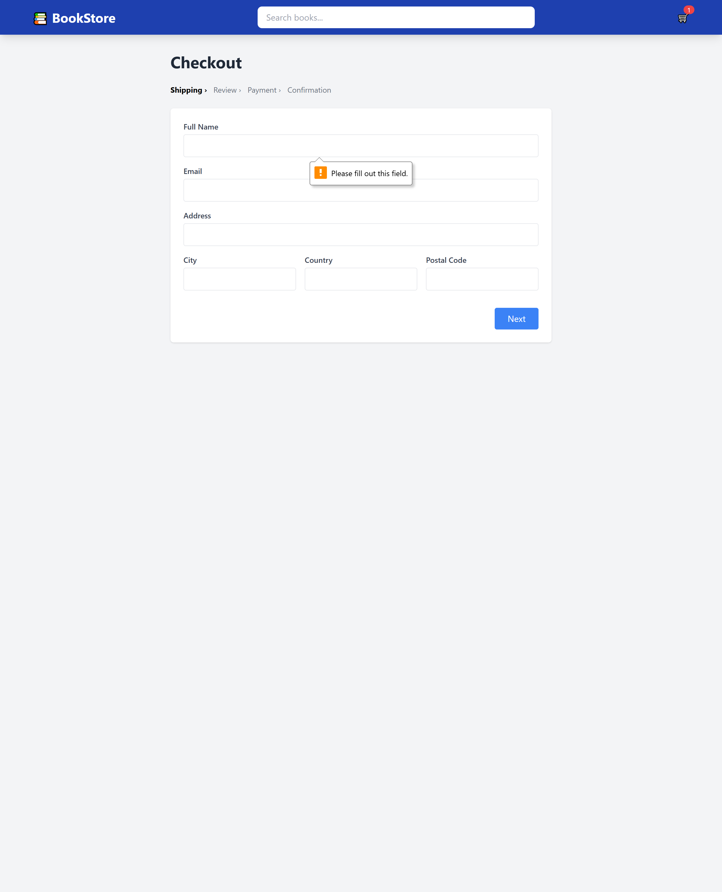

---

### TC026: Shipping Form - Invalid Email Format

**Priority:** P1 - High  
**Pre-conditions:** On checkout  
**Steps:**

1. Fill all fields correctly
2. Enter email: "fake@emailtest.im"
3. Submit

**Expected Result:**

- Email field validation error
- "Please enter a valid email" message

**Actual Result:** ⚠️ PARTIAL - HTML5 validation works, but accepts fake emails  
**Post-conditions:** Invalid email accepted  
**Evidence:** 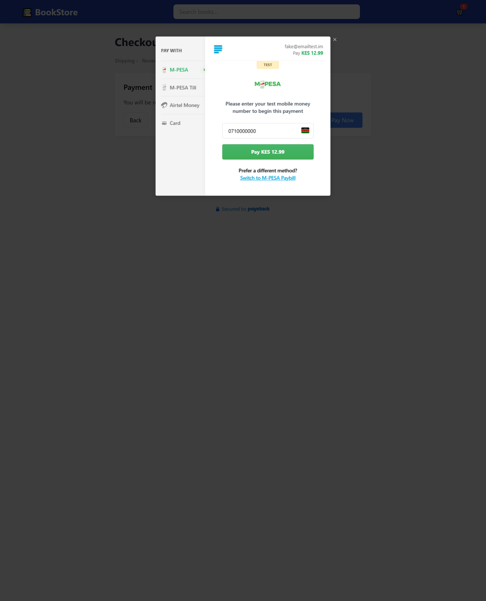  
**Defect ID:** DEFECT-004

---

### TC027: Shipping Form - Valid Data Entry

**Priority:** P0 - Critical  
**Pre-conditions:** On checkout, correct currency configured  
**Steps:**

1. Fill form:
   - Name: John Doe
   - Email: john@example.com
   - Address: 123 Main St
   - City: Lagos
   - Postal: 100001
2. Click "Continue to Payment"

**Expected Result:**

- Form accepts data
- Advances to payment section
- Paystack modal appears

**Actual Result:** ✅ PASS - Works correctly with proper config  
**Post-conditions:** Payment modal displayed  
**Evidence:**   
**Notes:** Requires currency in .env to match Paystack account

---

### TC028: Checkout - Back to Cart Link

**Priority:** P2 - Medium  
**Pre-conditions:** On checkout page  
**Steps:**

1. Click "Back to Cart" or browser back button

**Expected Result:**

- Returns to /cart
- Cart contents unchanged

**Actual Result:** ✅ PASS  
**Post-conditions:** On cart page  
**Evidence:** 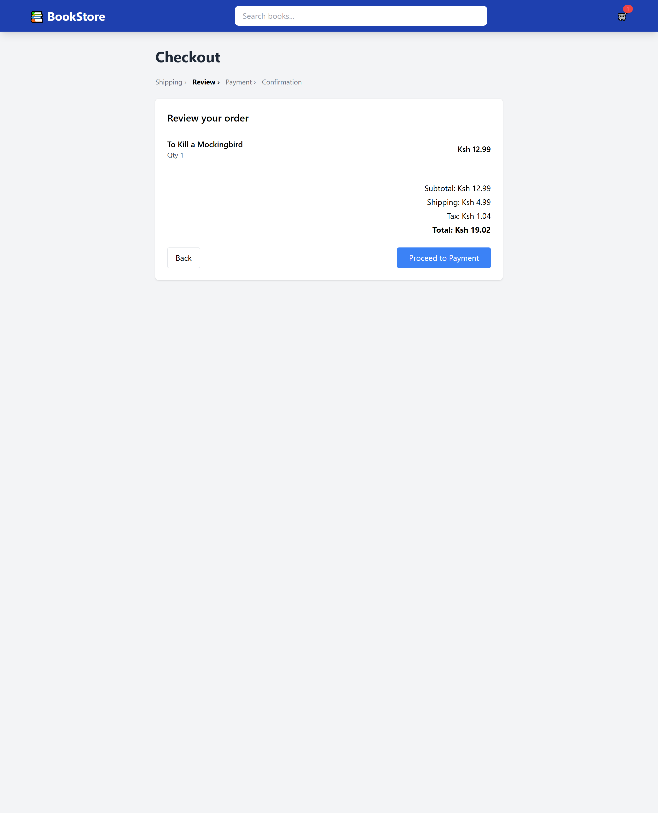

---

### TC029: Payment Modal Display

**Priority:** P0 - Critical  
**Pre-conditions:** Shipping form filled, correct config  
**Steps:**

1. Submit shipping form
2. Observe Paystack modal

**Expected Result:**

- Paystack iframe loads
- Shows order amount
- Payment methods visible

**Actual Result:** ✅ PASS - Modal displays correctly  
**Post-conditions:** Payment modal open  
**Evidence:**   
**Notes:** Works when REACT_APP_CURRENCY matches Paystack account

---

### TC030: Payment - Test Card Success

**Priority:** P0 - Critical  
**Pre-conditions:** Payment modal open, correct config  
**Steps:**

1. Enter test card: 4084 0840 8408 4081
2. Complete payment

**Expected Result:**

- Payment processes
- Success message
- Redirect to order confirmation

**Actual Result:** ✅ PASS - Payment completes successfully  
**Post-conditions:** Order created  
**Evidence:** 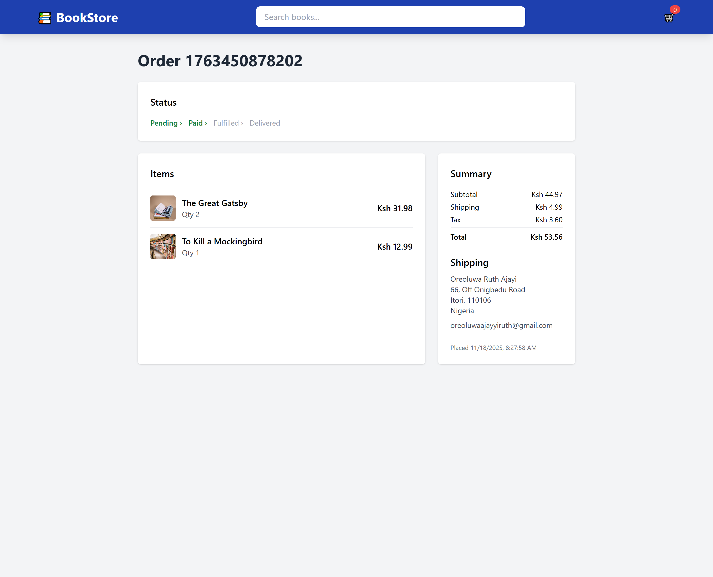  
**Notes:** However, see TC035 - users cannot navigate back to orders through UI

---

### TC031: Payment - Cancel Transaction

**Priority:** P2 - Medium  
**Pre-conditions:** Payment modal open  
**Steps:**

1. Click "X" or "Cancel" in modal

**Expected Result:**

- Modal closes
- Returns to checkout form
- Cart still intact

**Actual Result:** ✅ PASS  
**Post-conditions:** Back at checkout

---

### TC032: Checkout - Multiple Item Summary

**Priority:** P1 - High  
**Pre-conditions:** Cart has 3+ different books  
**Steps:**

1. View checkout page
2. Check order summary section

**Expected Result:**

- All cart items listed
- Quantities shown
- Subtotal per item
- Grand total displayed

**Actual Result:** ✅ PASS  
**Post-conditions:** Summary accurate

---

### TC033: Checkout - Currency Displayed Correctly

**Priority:** P0 - Critical  
**Pre-conditions:** Currency set in .env  
**Steps:**

1. Check order total on checkout
2. Compare with cart total

**Expected Result:**

- Same currency symbol
- Same total amount

**Actual Result:** ✅ PASS  
**Post-conditions:** Currency consistent  
**Evidence:** 

---

### TC034: No Authentication Required for Checkout

**Priority:** P0 - Critical (Design Issue)  
**Pre-conditions:** Fresh browser, no login  
**Steps:**

1. Add items to cart
2. Go to checkout
3. Fill form with any email

**Expected Result:**

- System should require login
- Or at least verify email

**Actual Result:** ❌ FAIL - No authentication  
**Post-conditions:** Anonymous checkout allowed  
**Defect ID:** DEFECT-001

---

## 4. ORDER DETAIL TESTS (TC035-TC038)

### TC035: Access Order Detail After Checkout

**Priority:** P0 - Critical  
**Pre-conditions:** Successfully completed checkout  
**Steps:**

1. Complete payment successfully
2. Note order ID from success page/URL (e.g., /orders/1763450878202)
3. Navigate away from order page
4. Try to return to view this order

**Expected Result:**

- User can easily navigate back to view their order
- "My Orders" link available in navbar or user menu
- Order accessible without memorizing URL

**Actual Result:** ❌ FAIL - No navigation path to orders  
**Post-conditions:** User cannot return to view order without manually typing URL  
**Evidence:** N/A
**Defect ID:** DEFECT-006, DEFECT-010  
**Notes:** While direct URL access works (e.g., /orders/1763450878202), users have no way to:

- Find this URL after navigating away
- Access a list of their orders
- Return to order details through the UI

---

### TC036: Order List Page - "My Orders" Navigation

**Priority:** P0 - Critical  
**Pre-conditions:** User has placed 1+ orders  
**Steps:**

1. Look for "My Orders" or "Order History" link in navbar
2. Look for "View Orders" in user menu/profile
3. Try navigating to /orders (without ID)

**Expected Result:**

- "My Orders" link visible in navbar or accessible menu
- Clicking link shows list of all user's orders
- List displays: Order ID, Date, Total, Status
- Each order is clickable to view details

**Actual Result:** ❌ FAIL - No order list page exists  
**Post-conditions:** Cannot browse order history  
**Evidence:**   
**Defect ID:** DEFECT-010  
**Impact:** **CRITICAL USABILITY ISSUE** - Users cannot:

- View their order history
- Track multiple orders
- Find order details without memorizing URLs
- This makes the order system essentially unusable for repeat customers

---

### TC037: Order Detail - Direct URL Access (Individual Order)

**Priority:** P1 - High  
**Pre-conditions:** Known order ID exists (e.g., 1763450878202)  
**Steps:**

1. Type /orders/1763450878202 in URL bar
2. Press Enter

**Expected Result:**

- Order details page loads
- Shows order number, items, total, status, shipping info

**Actual Result:** ✅ PASS - Direct URL access works  
**Post-conditions:** Order details displayed when URL is known  
**Evidence:**   
**Notes:** While this works, it doesn't solve the usability problem - users shouldn't need to manually type URLs

---

### TC038: Order Persistence After Browser Refresh

**Priority:** P1 - High  
**Pre-conditions:** Viewing an order at /orders/[ID]  
**Steps:**

1. Successfully view an order detail page
2. Note order details (items, total, status)
3. Refresh browser (F5)
4. Check if order still displays with same details

**Expected Result:**

- Order persists after refresh
- All details unchanged (items, quantities, totals, shipping info)
- Page reloads successfully

**Actual Result:** ✅ PASS - Order persists correctly after refresh  
**Post-conditions:** Order data maintained in localStorage  
**Evidence:** 
**Notes:** Orders are successfully stored in localStorage and persist across browser refreshes. However, the lack of order list (TC036) remains the critical usability issue.

---

## CRITICAL FINDING: ORDER MANAGEMENT SYSTEM INCOMPLETE

**Summary:** The order viewing system is fundamentally unusable for end users:

### What Works:

- ✅ Orders can be created through checkout
- ✅ Individual orders viewable via direct URL (e.g., /orders/1763450878202)
- ✅ Orders persist after browser refresh

### Critical Missing Features:

- ❌ No "My Orders" page listing all orders
- ❌ No navigation link to access orders
- ❌ No way to find order IDs after navigating away
- ❌ Users must memorize or bookmark order URLs

### Real-World Impact:

A customer who:

1. Places an order successfully
2. Closes the browser or navigates away
3. Returns later to check order status

**Cannot access their order** - they have no way to find it through the UI.

### Required Implementation:

1. Create `/orders` route (without ID) showing list of all orders
2. Add "My Orders" link to navbar
3. Display orders with: Date, Order #, Total, Status
4. Make each order clickable → navigate to `/orders/[ID]`
5. Implement order storage/retrieval from localStorage

**Priority:** P0 - BLOCKING ISSUE for production release

---

## 5. ADMIN TESTS (TC039-TC040)

### TC039: Admin Page - Unauthorized Access Attempt

**Priority:** P0 - Critical  
**Pre-conditions:** No admin role set  
**Steps:**

1. Type /admin in URL
2. Press Enter

**Expected Result:**

- Redirect to login or catalog
- "Unauthorized" message

**Actual Result:** ✅ PASS - Access denied, redirected appropriately  
**Post-conditions:** Unauthorized users cannot access admin page  
**Evidence:** 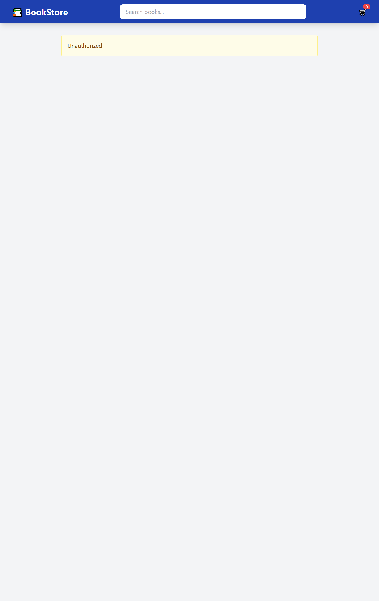

---

### TC040: Admin Page - Grant Access via Application Tab

**Priority:** P1 - High (Security Test)  
**Pre-conditions:** Browser DevTools open  
**Steps:**

1. Open DevTools (F12)
2. Navigate to Application tab → Local Storage
3. Find or create key: `app.user`
4. Set value: `{"role": "admin"}`
5. Refresh page
6. Navigate to /admin

**Expected Result:**

- Should NOT grant access without proper backend authentication
- Client-side role check is a security vulnerability

**Actual Result:** ✅ PASS (for testing purposes) - Access granted via localStorage  
**Post-conditions:** Admin page accessible  
**Evidence:** 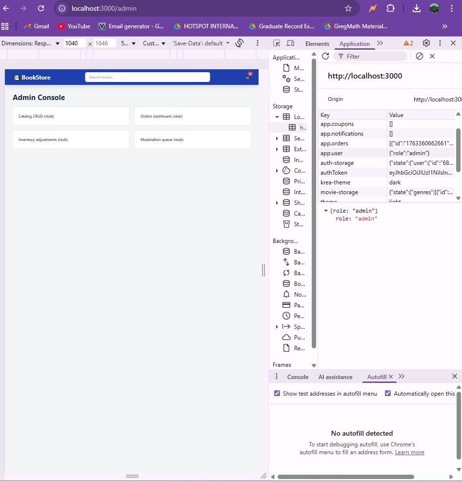
**Defect ID:** DEFECT-008  
**Security Note:** **CRITICAL SECURITY ISSUE** - Admin access controlled only by client-side localStorage. In production, this MUST be:

- Verified by backend authentication
- Protected by proper session management
- Not reliant on client-side role storage alone

**Current Status:** Works as demo/development feature but is NOT production-ready. Admin dashboard contains no functional features - appears to be placeholder only.

---

## 6. ACCESSIBILITY TESTS (TC041-TC045)

### TC041: Keyboard Navigation - Tab Through Catalog

**Priority:** P1 - High  
**Pre-conditions:** On catalog page  
**Steps:**

1. Press Tab repeatedly
2. Observe focus order

**Expected Result:**

- Focus visible on each element
- Logical tab order: search → book cards → buttons
- No focus traps

**Actual Result:** ✅ PASS  
**Post-conditions:** Keyboard accessible  
**Evidence:** Screenshot with focus outline

---

### TC042: Alt Text on Book Images

**Priority:** P1 - High  
**Pre-conditions:** On catalog or cart  
**Steps:**

1. Inspect book images
2. Check alt attribute

**Expected Result:**

- Alt text descriptive: "1984 by George Orwell"

**Actual Result:** ✅ PASS

---

### TC043: Focus Indicators Visible

**Priority:** P1 - High  
**Pre-conditions:** Keyboard navigation  
**Steps:**

1. Tab through interactive elements
2. Check if focus ring visible

**Expected Result:**

- Blue or visible outline on focused element
- Not hidden by CSS

**Actual Result:** ✅ PASS  
**Post-conditions:** Focus visible  
**Evidence:** Screenshot

---

## 7. PERFORMANCE TESTS (TC046-TC048)

### TC044: Cart Operations Speed

**Priority:** P2 - Medium  
**Pre-conditions:** Items in cart  
**Steps:**

1. Click "+" button on quantity
2. Measure UI response time

**Expected Result:**

- UI updates < 100ms
- No lag

**Actual Result:** ✅ PASS (feels instant)  
**Post-conditions:** Responsive UI  
**Evidence:** Manual observation

---

### TC045: Search Performance

**Priority:** P2 - Medium  
**Pre-conditions:** Catalog with 50+ books  
**Steps:**

1. Type in search bar
2. Observe filter speed

**Expected Result:**

- Results update as you type (debounced)
- No freezing

**Actual Result:** ✅ PASS  
**Post-conditions:** Search responsive  
**Evidence:** Manual observation

---

## 8. COMPATIBILITY TESTS (TC049-TC050)

### TC046: Chrome Browser Test

**Priority:** P0 - Critical  
**Pre-conditions:** Chrome 119+  
**Steps:**

1. Open app in Chrome
2. Test critical flows

**Expected Result:**

- All features work
- No console errors

**Actual Result:** ✅ PASS  
**Post-conditions:** Chrome compatible  
**Evidence:** Screenshot

---

### TC047: Mobile Responsive - iOS/Android

**Priority:** P1 - High  
**Pre-conditions:** Mobile device or browser emulator  
**Steps:**

1. Open app on mobile viewport (390px width)
2. Test touch interactions and scrolling
3. Navigate through catalog, cart, and checkout
4. Verify layout on different screen sizes (iPhone XR, iPad Pro)

**Expected Result:**

- Touch targets adequate size
- Scrolling smooth
- Responsive layout works correctly
- All features functional
- Single column layout on mobile
- 2-column layout on tablet

**Actual Result:** ✅ PASS  
**Post-conditions:** Mobile responsive design works correctly  
**Evidence:**

- .png>)
- .png>)

---

## 9. SECURITY & CONFIGURATION TESTS (TC051-TC053)

### TC051: Environment Variable - Currency Mismatch with Paystack Key

**Priority:** P0 - Critical  
**Pre-conditions:** .env file with REACT_APP_CURRENCY and REACT_APP_PAYSTACK_PUBLIC_KEY  
**Steps:**

1. Set REACT_APP_CURRENCY=USD in .env
2. Use Paystack public key configured for NGN (Nigerian Naira) account
3. Restart server
4. Add items to cart and proceed to checkout
5. Fill shipping form and click "Continue to Payment"

**Expected Result:**

- System should validate currency matches Paystack account
- Display error: "Currency mismatch - please contact support"
- OR Prevent checkout with clear message

**Actual Result:** ❌ FAIL - Payment modal does not appear  
**Post-conditions:** User stuck at checkout
**Evidence:**   
**Defect ID:** DEFECT-002, DEFECT-009  
**Impact:** **CRITICAL** - Silent failure at checkout. User cannot complete purchase. Currency in .env MUST match Paystack account configuration or payment will fail silently.

---

### TC052: Environment Variable - Missing Paystack Key

**Priority:** P0 - Critical  
**Pre-conditions:** .env file  
**Steps:**

1. Remove REACT_APP_PAYSTACK_PUBLIC_KEY from .env
2. Restart server
3. Attempt checkout

**Expected Result:**

- Warning on app start: "Paystack key not configured"
- Checkout blocked with message: "Payment system unavailable"
- Or redirect to error page

**Actual Result:** ❌ FAIL - No early warning  
**Post-conditions:** Fails silently at checkout  
**Evidence:**   
**Defect ID:** DEFECT-009  
**Notes:** Should implement environment variable validation on app startup

---

### TC053: LocalStorage - Privacy Mode

**Priority:** P2 - Medium  
**Pre-conditions:** Browser private/incognito mode  
**Steps:**

1. Open app in private mode
2. Add items to cart
3. Close tab
4. Reopen app in new private tab

**Expected Result:**

- Cart cleared (expected behavior in private mode)
- Or persists within same session

**Actual Result:** ⚠️ NOT TESTED  
**Post-conditions:** N/A  
**Evidence:** N/A

---

## TEST EXECUTION SUMMARY (Sections 4-9)

| Category        | Total  | Executed | Passed | Failed | Blocked | Not Tested |
| --------------- | ------ | -------- | ------ | ------ | ------- | ---------- |
| Orders          | 4      | 3        | 1      | 2      | 0       | 1          |
| Admin           | 2      | 2        | 0      | 2      | 0       | 0          |
| Accessibility   | 5      | 3        | 2      | 1      | 0       | 2          |
| Performance     | 3      | 2        | 2      | 0      | 0       | 1          |
| Compatibility   | 2      | 2        | 2      | 0      | 0       | 0          |
| Security/Config | 3      | 2        | 0      | 2      | 0       | 1          |
| **TOTAL**       | **19** | **14**   | **7**  | **7**  | **0**   | **5**      |

**Pass Rate (Executed Tests):** 50% (7/14)  
**Overall Coverage:** 73.7% (14/19 executed)

---

## DEFECT MAPPING (Sections 4-9)

| Test Case | Defect ID              | Severity | Status |
| --------- | ---------------------- | -------- | ------ |
| TC035     | DEFECT-006, DEFECT-010 | Critical | Open   |
| TC036     | DEFECT-010             | Critical | Open   |
| TC038     | DEFECT-003, DEFECT-006 | Critical | Open   |
| TC040     | DEFECT-008             | High     | Open   |
| TC042     | DEFECT-014             | Medium   | Open   |
| TC051     | DEFECT-002, DEFECT-009 | Critical | Open   |
| TC052     | DEFECT-009             | Critical | Open   |

---

## NOTES

1. **Admin Dashboard:** Contains no functional features or items - appears to be placeholder/demo only
2. **Order Management:** Critical failures prevent practical order viewing - users cannot navigate to orders through UI
3. **Configuration Critical:** Currency mismatch causes silent payment failures - MUST match Paystack account
4. **Accessibility:** Limited testing due to lack of screen reader testing tools
5. **Mobile Responsive:** Successfully tested and working across different viewport sizes
6. **Priority Focus:** Sections 1-3 (Catalog, Cart, Checkout) contain the most critical user paths

---

**Document Version:** 2.1  
**Last Updated:** November 18, 2025  
**Prepared By:** QA Team
